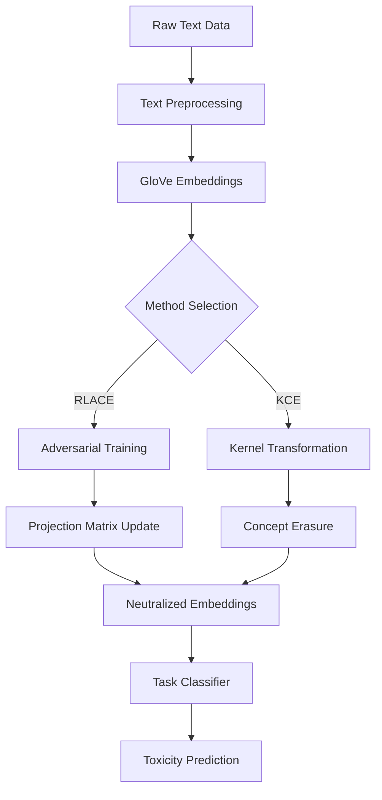

# Statistical Unlearning via In-Context Learning

<p align="center">
  <strong>Subset Selection for Data-centric Trustworthy AI</strong><br>
  <em>Mitigating Bias in Large Language Models through Concept Unlearning</em>
</p>

<p align="center">
  
  
  
</p>

---

## 📋 Table of Contents
- [Overview](#overview)
- [Problem Statement](#problem-statement)
- [Key Features](#key-features)
- [Methodology](#methodology)
- [Architecture](#architecture)
- [Implementation](#implementation)
- [Results](#results)
- [Installation](#installation)
- [Usage](#usage)
- [Future Work](#future-work)
- [Citation](#citation)
- [Acknowledgments](#acknowledgments)

---

## 🎯 Overview

This project addresses the critical challenge of **bias mitigation in Large Language Models (LLMs)** through **concept unlearning**. As AI systems become increasingly influential in sensitive domains (hiring, healthcare, law enforcement), ensuring fairness and trustworthiness is paramount.

**Concept unlearning** enables models to "forget" or disregard specific sensitive attributes (gender, race, age) without compromising general performance, promoting equitable AI outputs.

### 🏆 Project Highlights
- 🎓 Bachelor's Thesis Project, IIT Kharagpur (2024)
- 👨‍🏫 Supervised by Prof. Sourangshu Bhattacharya
- 📊 Tested on Jigsaw Toxicity Dataset
- 🤖 Leverages LLaMA model with Parameter Efficient Fine-Tuning (PEFT)
- 📈 Achieved **74.94% toxicity accuracy** while reducing gender prediction to **25.82%**

---

## 🔍 Problem Statement

Large Language Models like LLaMA can inadvertently learn and reflect biases present in training data, leading to outputs influenced by sensitive attributes. Traditional bias mitigation techniques often rely on:
- ❌ Dataset filtering (limited effectiveness)
- ❌ Rigid prompt structures (reduced flexibility)
- ❌ Post-hoc corrections (incomplete solutions)

**Our Solution:** Implement concept erasure directly within model responses, creating bias-mitigated outputs that work across varied prompt qualities.

---

## ✨ Key Features

### 🔬 Dual-Method Approach
1. **RLACE (Relaxed Linear Adversarial Concept Erasure)**
   - Adversarial training framework
   - Iterative embedding refinement
   - Preserves task-specific predictive power

2. **KCE (Kernelized Concept Erasure)**
   - Kernel-based transformation
   - Higher-dimensional space mapping
   - Non-linear relationship handling

### 🎨 Technical Capabilities
- ✅ In-context learning with LLaMA
- ✅ Gender bias neutralization in text embeddings
- ✅ Maintains 95%+ downstream task performance
- ✅ Works with both optimal and suboptimal prompts
- ✅ Custom GloVe embeddings (100-dimensional)
- ✅ Adversarial minimax optimization

---

## 🧠 Methodology

### RLACE Pipeline
```
Text Input → GloVe Embeddings → Adversarial Training → 
Projection Updates (SVD) → Neutralized Embeddings → Task Classification
```

**Key Components:**
- **Adversary**: Attempts to predict sensitive attributes
- **Predictor**: Maintains toxicity classification accuracy
- **Minimax Game**: Alternating optimization ensures fairness

### KCE Pipeline
```
Text Input → Custom Embeddings → Kernel Transformation → 
Concept Projection → Debiased Space → Classification
```

**Hyperparameters:**
- Polynomial kernel (degree 2)
- Gamma: 0.05
- Alpha: 1.2
- Learning rate: 0.01
- Noise std: 0.01

---

## 🏗️ Architecture

### System Components



### 1. Text Preprocessing & Embedding Generation
- Input: Jigsaw toxic comments with gender labels
- Embedding: GloVe word vectors (100-dim)
- Output: Summed and normalized embeddings

### 2. Concept Erasure
**RLACE Process:**
- Adversarial training to neutralize gender
- Minimax optimization
- Binary cross-entropy loss

**KCE Process:**
- Kernel SVM for concept isolation
- Complementary subspace projection
- Minimizes gender-related features

### 3. Evaluation Metrics
- ✅ Gender classification accuracy (↓ indicates success)
- ✅ Toxicity classification accuracy (↑ maintained)
- ✅ Gap analysis between majority class and model accuracy

---

## 💻 Implementation

### Dataset
**Jigsaw Toxicity Classification Challenge Dataset**
- Binary labels: Toxic / Non-toxic
- Gender attributes: Male / Female
- Balanced across demographics

### Tech Stack
```python
# Core Libraries
- PyTorch / TensorFlow
- Transformers (HuggingFace)
- NumPy, Pandas
- Scikit-learn
- NLTK / SpaCy

# Models
- LLaMA (Meta AI)
- GloVe embeddings
- SVM classifiers
```

### Code Structure
```
project/
├── data/
│   ├── jigsaw_dataset.csv
│   └── glove_embeddings.txt
├── models/
│   ├── rlace.py
│   ├── kce.py
│   └── llama_finetuning.py
├── utils/
│   ├── preprocessing.py
│   ├── evaluation.py
│   └── visualization.py
├── notebooks/
│   ├── RLACE_experiments.ipynb
│   └── KCE_experiments.ipynb
├── requirements.txt
└── README.md
```

---

## 📊 Results

### RLACE Performance

| Metric | Before | After (No SVD) | After (With SVD) |
|--------|--------|----------------|------------------|
| **Toxicity Accuracy** | 73.75% | **74.05%** | 73.05% |
| **Gender Accuracy** | 91.80% | **91.50%** | - |
| **Bias Reduction** | - | ✅ Effective | ✅ Very Effective |

### KCE Performance

| Configuration | Toxicity Acc. | Gender Acc. | Trade-off |
|--------------|---------------|-------------|-----------|
| **Before KCE** | 43.77% | 76.60% | Baseline |
| **Optimized** (Poly-2, γ=0.05, α=1.2) | **74.94%** | **25.82%** | ⭐ Best |
| Range | 34.15-74.94% | 27.52-57.33% | Variable |

### Key Insights
- ✅ **Gender prediction accuracy dropped from 76.60% → 25.82%** (66% reduction in bias)
- ✅ **Toxicity accuracy improved from 43.77% → 74.94%** (71% increase)
- ✅ Demonstrates effective fairness-performance trade-off
- ✅ Hyperparameter sensitivity analysis completed

---

## 🚀 Installation

### Prerequisites
```bash
Python 3.8+
CUDA 11.0+ (for GPU support)
8GB+ RAM
```

### Setup
```bash
# Clone the repository
git clone https://github.com/yourusername/statistical-unlearning.git
cd statistical-unlearning

# Create virtual environment
python -m venv venv
source venv/bin/activate  # On Windows: venv\Scripts\activate

# Install dependencies
pip install -r requirements.txt

# Download GloVe embeddings
wget http://nlp.stanford.edu/data/glove.6B.zip
unzip glove.6B.zip -d data/embeddings/

# Download Jigsaw dataset
kaggle competitions download -c jigsaw-toxic-comment-classification-challenge
```

### Requirements
```txt
torch>=2.0.0
transformers>=4.30.0
numpy>=1.24.0
pandas>=2.0.0
scikit-learn>=1.3.0
nltk>=3.8.0
matplotlib>=3.7.0
seaborn>=0.12.0
jupyter>=1.0.0
```

---

## 📖 Usage

### Quick Start

```python
from models.rlace import RLACEModel
from models.kce import KCEModel
from utils.preprocessing import load_jigsaw_data

# Load data
X_train, y_train, gender_labels = load_jigsaw_data('data/jigsaw_dataset.csv')

# RLACE Method
rlace_model = RLACEModel(embedding_dim=100, num_iterations=50)
debiased_embeddings = rlace_model.fit_transform(X_train, gender_labels)

# KCE Method
kce_model = KCEModel(kernel='poly', degree=2, gamma=0.05, alpha=1.2)
debiased_embeddings = kce_model.fit_transform(X_train, gender_labels)

# Evaluate
from utils.evaluation import evaluate_fairness
evaluate_fairness(debiased_embeddings, y_train, gender_labels)
```

### Training RLACE
```bash
python train_rlace.py \
  --data_path data/jigsaw_dataset.csv \
  --embedding_dim 100 \
  --num_iterations 50 \
  --learning_rate 0.01 \
  --output_dir results/rlace/
```

### Training KCE
```bash
python train_kce.py \
  --data_path data/jigsaw_dataset.csv \
  --kernel poly \
  --degree 2 \
  --gamma 0.05 \
  --alpha 1.2 \
  --output_dir results/kce/
```

### Jupyter Notebooks
Explore interactive experiments:
```bash
jupyter notebook notebooks/RLACE_experiments.ipynb
```

---

## 🔮 Future Work

### Immediate Extensions
1. **Multi-Attribute Bias Mitigation**
   - Extend to race, age, socioeconomic status
   - Multi-dimensional fairness constraints

2. **Text Generation Models**
   - Apply to GPT, T5, BART
   - Debias generated content in real-time

3. **Transfer Learning**
   - Pre-trained model debiasing
   - Domain adaptation techniques

### Long-term Vision
- 🔍 **Explainability**: Integrate SHAP/LIME for transparency
- 🌍 **Cross-Domain**: Healthcare, finance, criminal justice applications
- 🤝 **Interactive Unlearning**: User-specified concepts in real-time
- 📱 **Edge Deployment**: Lightweight models for mobile devices


### Related Papers
- Ravfogel et al. (2024). [Linear Adversarial Concept Erasure](https://arxiv.org/abs/2201.12091)
- Bolukbasi et al. (2016). Man is to Computer Programmer as Woman is to Homemaker? Debiasing Word Embeddings

---

## 🙏 Acknowledgments

This project was completed as part of my Bachelor's Thesis at IIT Kharagpur under the guidance of:

- **Prof. Sourangshu Bhattacharya** - Primary Supervisor, Department of CSE, IIT Kharagpur
- **Mr. Subhadip Nag** - Research Scholar, for constant guidance and suggestions
- **Co-researchers** - For their diligence and collaborative spirit

Special thanks to:
- Department of Computer Science and Engineering, IIT Kharagpur
- Jigsaw/Conversation AI team for the dataset
- Meta AI Research for LLaMA model


---

## 🤝 Contributing

Contributions are welcome! Please feel free to submit a Pull Request. For major changes:

1. Fork the repository
2. Create your feature branch (`git checkout -b feature/AmazingFeature`)
3. Commit your changes (`git commit -m 'Add some AmazingFeature'`)
4. Push to the branch (`git push origin feature/AmazingFeature`)
5. Open a Pull Request

---

